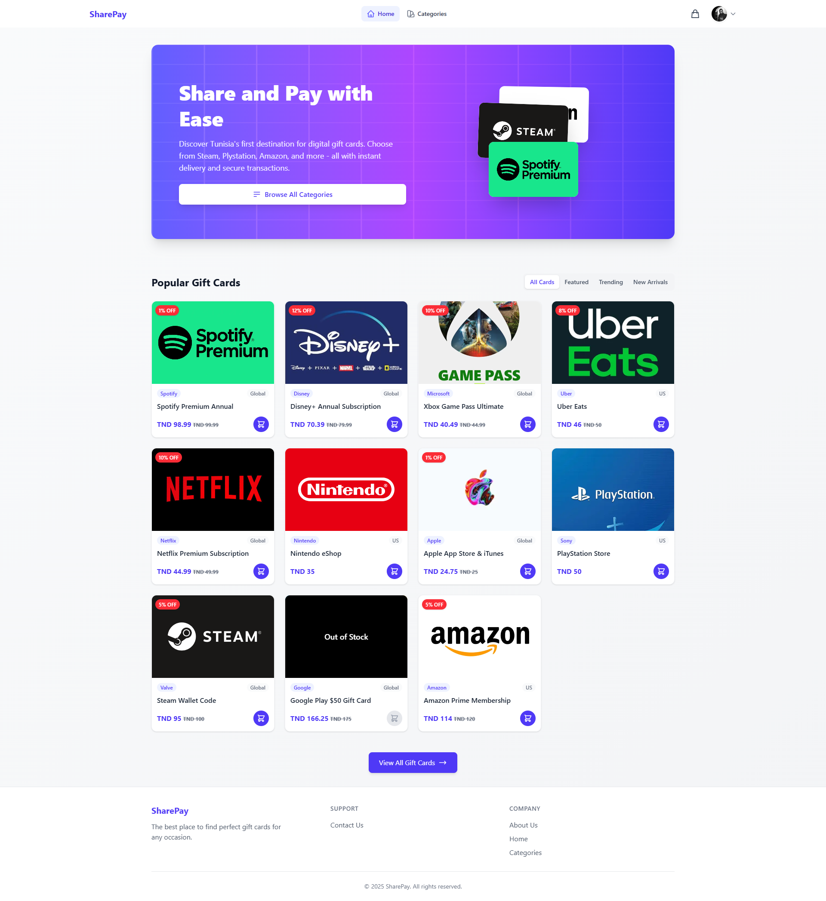
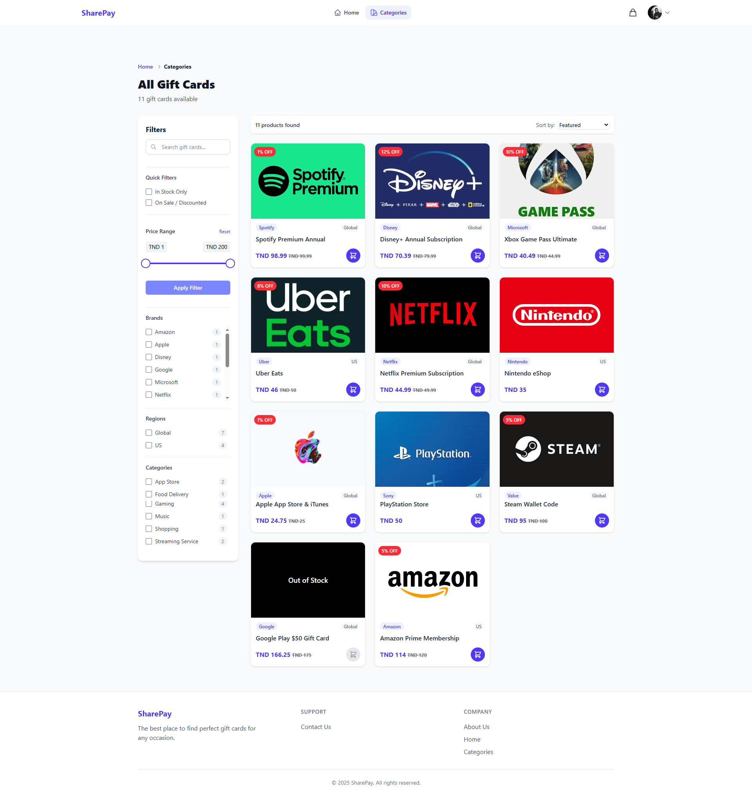
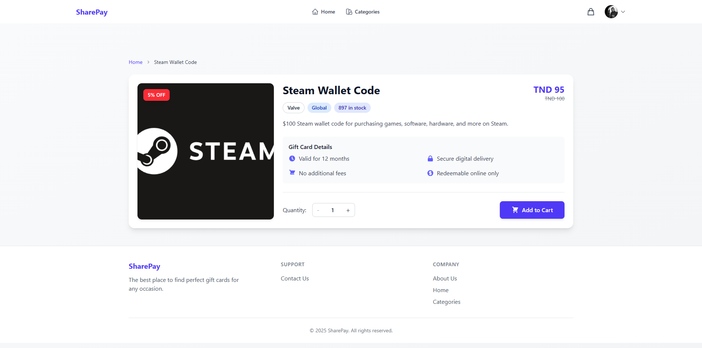
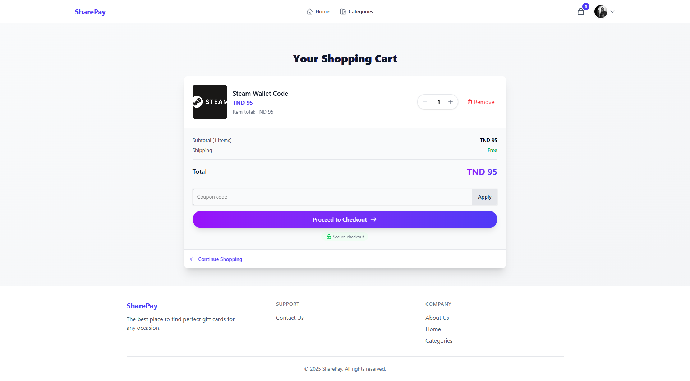
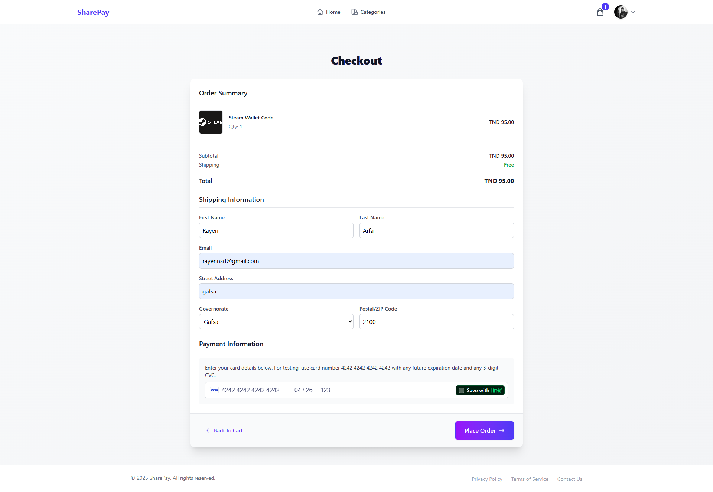
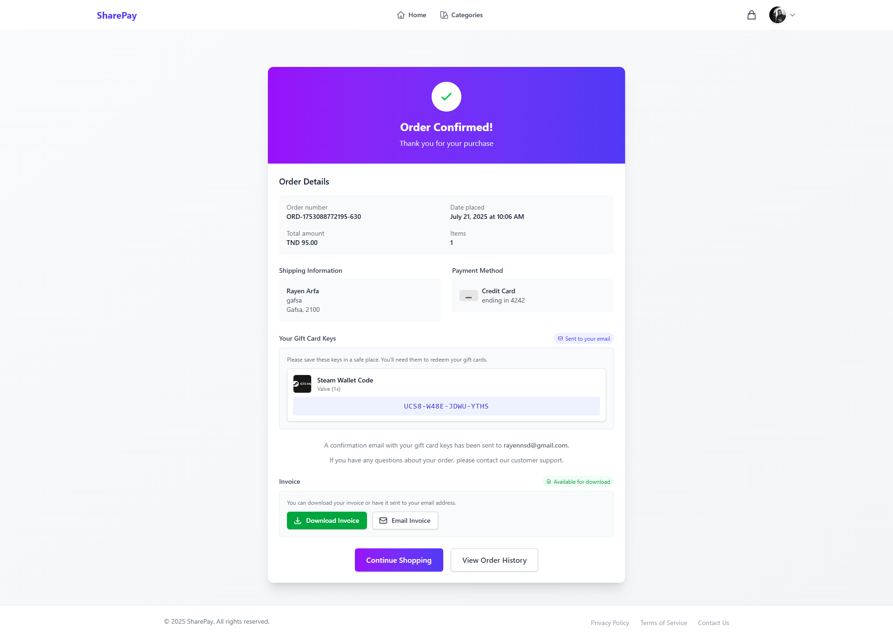
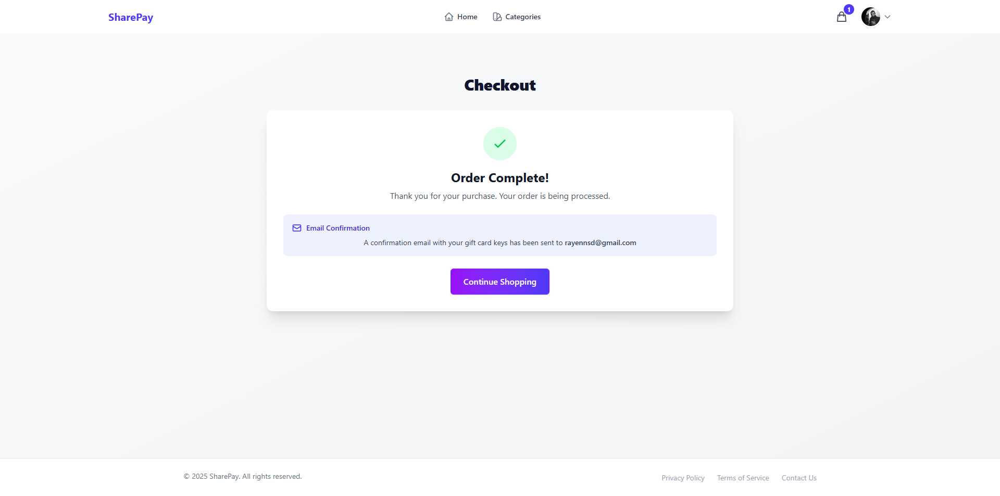
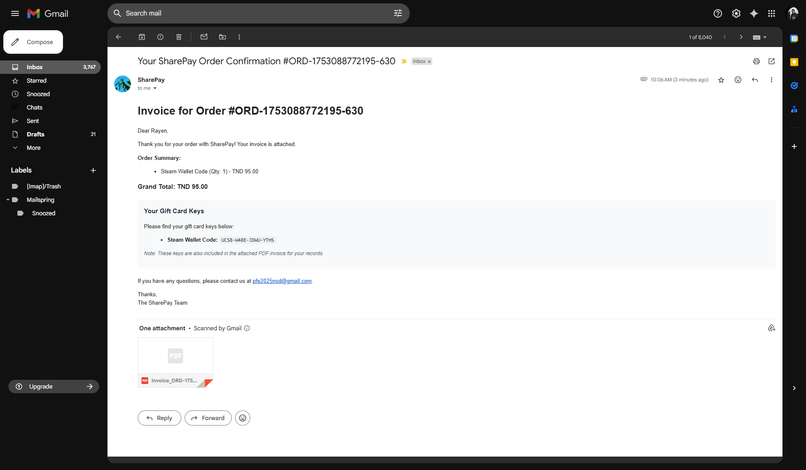
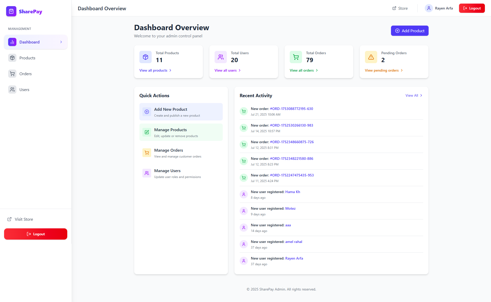
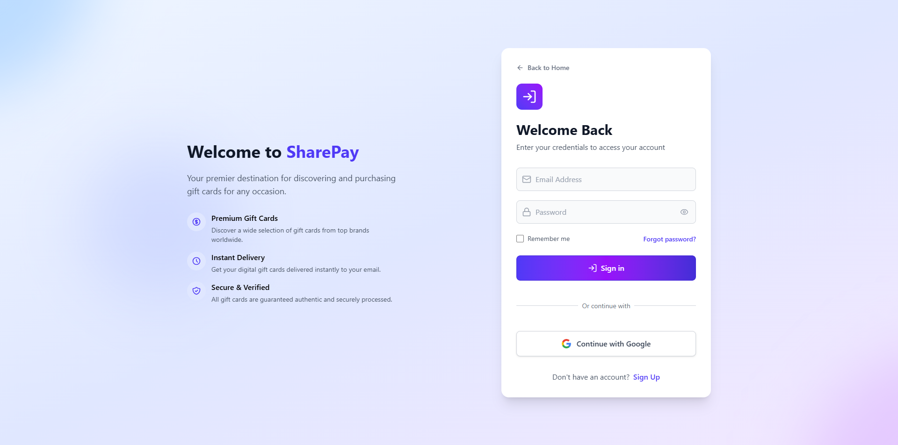

# 🎁 SharePay - Gift Card E-commerce Platform

A modern, full-stack e-commerce platform for digital gift cards built with React, Node.js, and Stripe payment processing.



## ✨ Features

- 🛍️ **E-commerce Platform**: Complete gift card marketplace
- 💳 **Secure Payments**: Stripe integration for safe transactions
- 📧 **Email Notifications**: Automated order confirmations and receipts
- 🔐 **User Authentication**: Firebase authentication system
- 📱 **Responsive Design**: Mobile-first approach with Tailwind CSS
- 🎨 **Modern UI**: Beautiful animations with Framer Motion
- 📊 **Admin Dashboard**: Order management and analytics
- 🧾 **PDF Generation**: Automatic invoice and receipt generation

## 🖼️ Screenshots

### Homepage

*Main landing page showcasing featured gift cards and categories*

### Product Categories

*Browse gift cards by category with filtering options*

### Product Page

*Detailed product view with pricing and purchase options*

### Shopping Cart

*Shopping cart with quantity management and total calculation*

### Checkout Process

*Secure checkout with Stripe payment integration*

### Order Confirmation

*Order confirmation page with transaction details*

### Order Complete

*Order completion with download options and email confirmation*

### Email Receipt

*Automated email receipt with order details and PDF attachment*

### Admin Dashboard

*Admin panel for order management and analytics*

### Sign In

*User authentication with Firebase*

## 🚀 Quick Start

### Prerequisites
- Node.js 18.x or higher
- npm or yarn package manager

### Installation

1. **Clone the repository**
   ```bash
   git clone https://github.com/rayenarfa/Sharepay.git
   cd Sharepay
   ```

2. **Install dependencies**
   ```bash
   # Install all dependencies (client + server)
   npm run install:all
   ```

3. **Environment Setup**
   ```bash
   # Copy environment files
   cp .env.example .env.local
   ```
   
   Fill in your credentials in `.env.local`:
   - Stripe API keys
   - Firebase configuration
   - Email service credentials

4. **Start development servers**
   ```bash
   # Start both client and server
   npm run dev:full
   ```

5. **Access the application**
   - Frontend: http://localhost:5173
   - Backend: http://localhost:3001

## 🛠️ Tech Stack

### Frontend
- **React 19** - Modern React with hooks
- **TypeScript** - Type-safe development
- **Vite** - Fast build tool and dev server
- **Tailwind CSS** - Utility-first CSS framework
- **Framer Motion** - Smooth animations
- **React Router** - Client-side routing
- **Stripe Elements** - Payment form components

### Backend
- **Node.js** - JavaScript runtime
- **Express.js** - Web application framework
- **Stripe** - Payment processing
- **Nodemailer** - Email service
- **PDFKit** - PDF generation
- **CORS** - Cross-origin resource sharing

### Services
- **Firebase** - Authentication and hosting
- **Stripe** - Payment processing
- **Gmail SMTP** - Email delivery

## 📁 Project Structure

```
sharepay/
├── client/                 # React frontend
│   ├── src/
│   │   ├── components/     # Reusable UI components
│   │   ├── pages/         # Page components
│   │   ├── hooks/         # Custom React hooks
│   │   ├── utils/         # Utility functions
│   │   └── types/         # TypeScript type definitions
│   ├── public/            # Static assets
│   └── package.json       # Frontend dependencies
├── server/                # Node.js backend
│   ├── functions/         # Serverless functions
│   ├── server.js          # Main server file
│   ├── server-utils.js    # Server utilities
│   └── package.json       # Backend dependencies
├── screenshots/           # Application screenshots
├── package.json           # Root package configuration
└── README.md             # This file
```

## 🎯 Available Scripts

### Development
```bash
npm run dev:client      # Start React dev server
npm run dev:server      # Start Node.js dev server  
npm run dev:full        # Start both servers concurrently
```

### Production
```bash
npm run build:client    # Build React for production
npm run start:server    # Start production server
```

### Utilities
```bash
npm run install:all     # Install all dependencies
npm run clean          # Clean node_modules and build files
```

## 🌐 Deployment

This application can be deployed to various platforms:

- **Railway** (Recommended) - Full-stack deployment
- **Render** - Free tier available
- **Vercel** - Great for React apps
- **Netlify** - Static site hosting

See [DEPLOY.md](./DEPLOY.md) for detailed deployment instructions.

## 🔧 Configuration

### Environment Variables

Create a `.env.local` file in the root directory:

```env
# Stripe Configuration
VITE_STRIPE_PUBLISHABLE_KEY=pk_test_your_stripe_key
VITE_STRIPE_SECRET_KEY=sk_test_your_stripe_secret_key

# Email Configuration
VITE_EMAIL_USER=your-email@gmail.com
VITE_EMAIL_PASSWORD=your-gmail-app-password

# Firebase Configuration
VITE_FIREBASE_API_KEY=your-firebase-api-key
VITE_FIREBASE_AUTH_DOMAIN=your-project.firebaseapp.com
VITE_FIREBASE_PROJECT_ID=your-project-id
VITE_FIREBASE_STORAGE_BUCKET=your-project.appspot.com
VITE_FIREBASE_MESSAGING_SENDER_ID=123456789
VITE_FIREBASE_APP_ID=1:123456789:web:abcdef
```

## 📚 Documentation

- **Quick Start**: [QUICK_START.md](./QUICK_START.md)
- **Deployment**: [DEPLOY.md](./DEPLOY.md)
- **Client Documentation**: [client/README.md](./client/README.md)
- **Server Documentation**: [server/README.md](./server/README.md)

## 🤝 Contributing

1. Fork the repository
2. Create a feature branch (`git checkout -b feature/amazing-feature`)
3. Commit your changes (`git commit -m 'Add some amazing feature'`)
4. Push to the branch (`git push origin feature/amazing-feature`)
5. Open a Pull Request

## 📄 License

This project is licensed under the MIT License - see the [LICENSE](LICENSE) file for details.

## 👥 Team

- **SharePay Team** - Development and Design

## 🆘 Support

If you encounter any issues or have questions:

1. Check the [documentation](./QUICK_START.md)
2. Search existing [issues](../../issues)
3. Create a new issue with detailed information

---

**Made with ❤️ by the SharePay Team**
